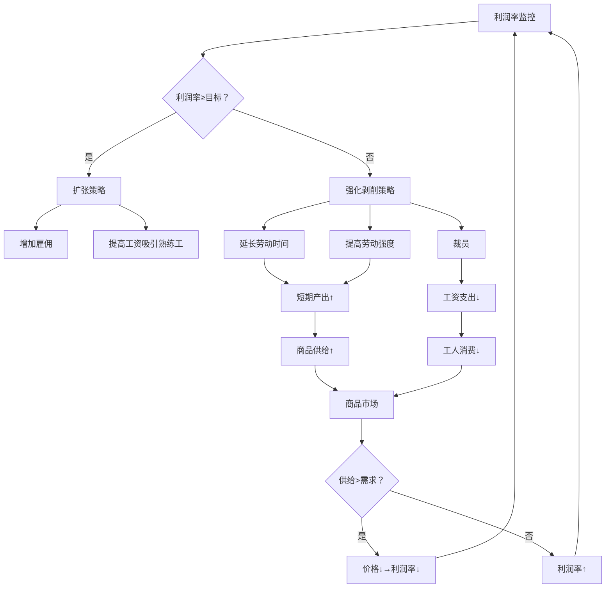
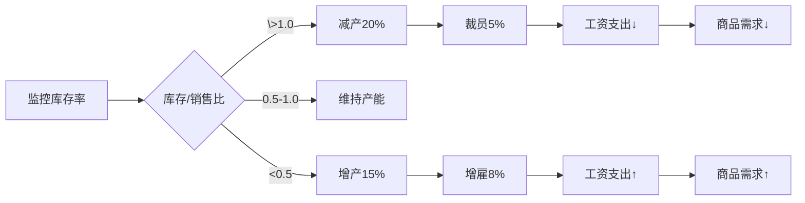
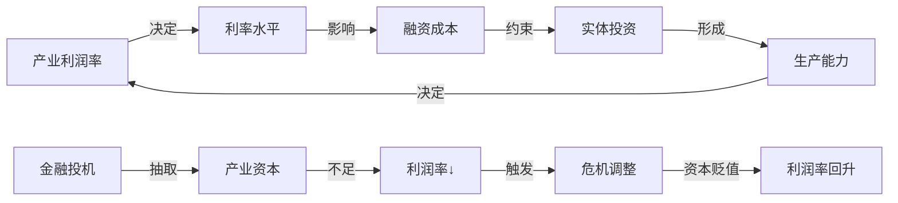
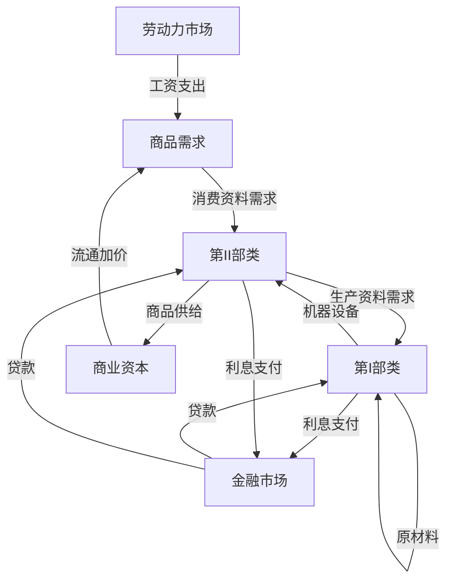
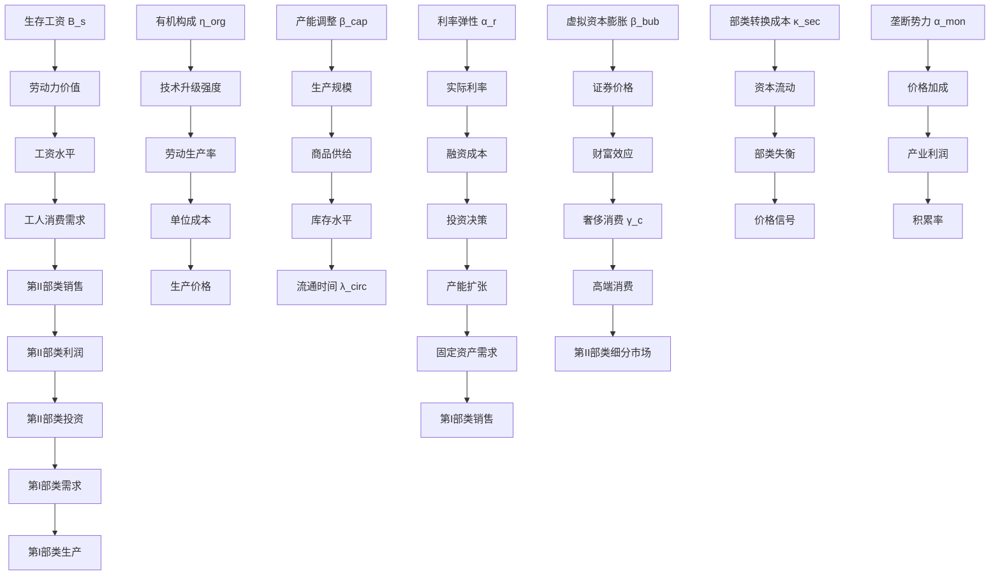
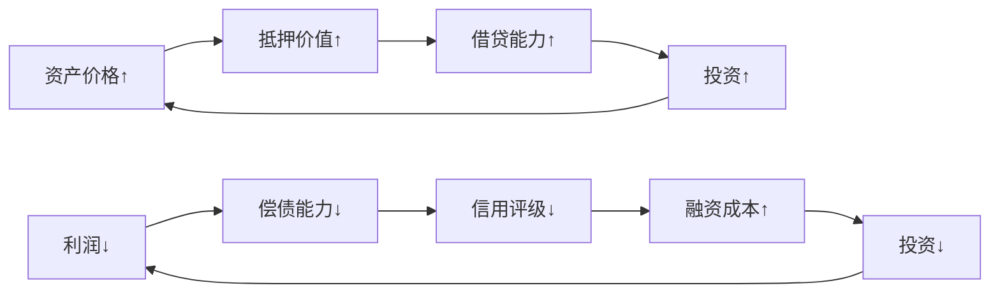

# 环境（市场）设计框架

## 劳动力市场机制

### 核心理论基础（《资本论》第一卷）
1. **劳动力商品化**  
   - 劳动力价值 = 再生产劳动力所需生活资料价值
   - 工资是劳动力价值的货币表现形式

2. **产业后备军理论**  
   - 相对过剩人口是资本积累的必然产物
   - 失业率调节工资水平：失业↑ → 工资议价能力↓

3. **资本对劳动的控制**  
   - 资本通过调节劳动时间、强度、雇佣规模实现剩余价值最大化
   - 绝对剩余价值（延长劳动时间）与相对剩余价值（提高生产率）的辩证关系

### 机制

#### 资本主导的劳动力需求系统
```math
\begin{aligned}
&\text{雇佣需求 } D_t = \sum_{i=1}^N \left( \frac{v_i}{w_i} \right) \times \text{utilization}_i \\
&v_i = \text{capital}_i \times \frac{1}{\text{org\_composition}_i + 1} \\
&\text{utilization}_i = 
\begin{cases} 
& \text{profit\_rate}_i \geq 0.15 \\
& \leq \text{profit\_rate}_i < 0.15 \\
& \text{profit\_rate}_i < 0.1
\end{cases}
\end{aligned}
```
- **资本有机构成 (c/v) 的核心作用**：
  - 高c/v → 技术密集型 → 单位资本雇佣少
  - 低c/v → 劳动密集型 → 单位资本雇佣多

- **利润率驱动的调节机制**：
  | 利润率区间 | 雇佣倾向 | 劳动强度调节 |
  | ---------- | -------- | ------------ |
  | >15%       | 扩张雇佣 | 维持强度     |
  | 10-15%     | 维持现状 | +10%强度     |
  | <10%       | 裁员5%   | +20%强度     |

#### 工资决定机制（产业后备军调节）
```math
w_{t+1} = w_t \times \left(1 + 0.05 \times \frac{\text{reserve\_army\_threshold} - u_t}{\text{reserve\_army\_threshold}}\right)
```
- **失业率 (u) 与工资关系**：
  ```math
  \begin{cases}
  \text{当 } u_t < 0.05: & \text{工资增速 } 5\%/\text{周期} \\
  \text{当 } 0.05 \leq u_t < 0.1: & \text{工资增速 } 0\% \\
  \text{当 } u_t \geq 0.1: & \text{工资增速 } -3\%/\text{周期}
  \end{cases}
  ```
- **劳动力价值下限约束**：
  
  ```math
  w_t \geq \text{subsistence\_level} \times \text{price\_basket}
  ```

#### 劳动强度与时间调节（资本主动控制）
```math
\begin{aligned}
&\text{强度乘数 } \alpha = + \times \frac{0.15 - \text{profit\_rate}}{0.15} \\
&\text{时间乘数 } \beta = 
\begin{cases} 
& \text{profit\_rate} \geq 0.12 \\
& 0.08 \leq \text{profit\_rate} < 0.12 \\
& \text{profit\_rate} < 0.08
\end{cases} \\
&\text{实际产出} = \text{理论产出} \times \alpha \times \beta \times \text{health\_index}
\end{aligned}
```
- **健康损耗反馈**：
  ```math
  \text{health\_index}_{t+1} = \text{health\_index}_t - \times (\alpha-1) - 0.15 \times (\beta-1)
  ```

#### 产业后备军动态生成
```math
\begin{aligned}
&\text{过剩人口} = \max(0, L_t - D_t) \\
&\text{技术性失业} = \times \Delta(\text{c/v}) \times \text{industrial\_capital} \\
&\text{周期性失业} = \times \max(0, \text{gdp\_growth\_trend} - \text{gdp\_growth}_t)
\end{aligned}
```

### 劳动力市场与商品市场联动

#### 工资→消费需求传导
```math
\begin{aligned}
&\text{工人消费需求} = \sum \text{wages} \times \text{consumption\_propensity} \\
&\text{consumption\_propensity} = 
\begin{cases} 
0.95 & \text{wage} > \times \text{subsistence} \\
0.85 & \text{subsistence} \leq \text{wage} \leq \times \text{subsistence} \\
0.70 & \text{wage} < \text{subsistence}
\end{cases}
\end{aligned}
```

#### 生活资料价格→劳动力价值
```math
\begin{aligned}
&\text{subsistence\_basket} = \{ \text{food}: 0.4, \text{clothing}: 0.3, \text{housing}: \} \\
&\text{subsistence\_cost}_t = \sum (p_{i,t} \times q_i) \\
&\text{工资调整压力} = \times \frac{\text{subsistence\_cost}_t - w_t}{w_t}
\end{aligned}
```

#### 失业→消费衰减
```math
\text{有效需求损失} = \text{unemployed} \times \text{unemployment\_benefit} \times 0.6
```

### 资本决策逻辑框架



### 参数基准体系

| **参数**         | **符号** | **基准值** | **理论依据**         |
| ---------------- | -------- | ---------- | -------------------- |
| 必要生存资料量   | q        | 1.0        | 劳动力再生产最低标准 |
| 有机构成敏感系数 | η        | 0.2        | 技术进步的失业效应   |
| 健康损耗强度系数 | λ_α      | 0.1        | 劳动强度与职业病关系 |
| 健康损耗时间系数 | λ_β      | 0.15       | 过长工时的生理影响   |
| 工资调整速度     | ν_w      | 0.05       | 劳动力市场黏性       |
| 后备军临界值     | u*       | 0.05       | 自然失业率概念       |

### 机制创新点

1. **双向反馈环**  
   - 正向：资本积累→技术升级→有机构成↑→失业↑→工资↓  
   - 负向：工资↓→消费↓→商品滞销→利润↓→裁员↑  

2. **劳动力价值刚性**  
   - 生活资料价格通胀自动触发工资调整压力  
   - 突破生存底线可能引发罢工（健康指数<0.4触发）  

3. **剥削策略动态组合**  
   - 资本根据利润率自动选择：
     - 时间剥削（绝对剩余价值）
     - 强度剥削（相对剩余价值）
     - 规模调整（雇佣量变化）

4. **失业结构分化**  
   - **流动形态**：暂时失业（可快速再就业）  
   - **潜在形态**：农业剩余劳动力  
   - **停滞形态**：长期失业（技能淘汰）  

此设计严格遵循《资本论》第一卷的核心原理：
1. 工资铁律：始终围绕劳动力价值波动
2. 产业后备军：失业作为资本积累的必然产物
3. 剥削形式转化：绝对→相对剩余价值的动态演变
4. 再生产循环：劳动力市场与商品市场的价值交换闭环

---

## 商品市场机制

### 核心理论基础（《资本论》第二卷）
1. **资本循环公式**：  
   - `G-W...P...W'-G'`  
   - 关键转化：`W'-G'`（商品资本→货币资本）

2. **生产价格形成**：  
   - `生产价格 = 成本价格(c+v) + 平均利润`  
   - 市场价格围绕生产价格波动

3. **流通时间效应**：  
   - 流通时间↑ → 资本周转率↓ → 年利润率↓  
   - 马克思："流通时间成为价值创造的限制"

### 机制

#### 供给端：资本生产决策主导
```math
\begin{aligned}
&\text{供给量 } Q_s = \sum_{i=1}^N \text{production}_i \times (1 - \text{breakdown\_rate}) \\
&\text{production}_i = \text{capacity}_i \times \text{utilization}_i \\
&\text{utilization}_i = 
\begin{cases} 
0.95 & \text{inventory}_i/\text{sales}_i < \\
0.75 & \leq \text{inventory}_i/\text{sales}_i < \\
0.60 & \text{inventory}_i/\text{sales}_i \geq 1.0
\end{cases}
\end{aligned}
```
- **产能调整规则**：
  
  | 库存销售比 | 产能利用率 | 资本行为 |
  | ---------- | ---------- | -------- |
  | <0.5       | 95%        | 扩大生产 |
  | 0.5-1.0    | 75%        | 维持现状 |
  | ≥1.0       | 60%        | 减产裁员 |

#### 需求端：购买力决定市场实现
```math
\begin{aligned}
&\text{有效需求 } Q_d = \frac{\sum \text{wages}}{P_c} \times \gamma_w + \frac{\sum \text{profits}}{P_l} \times \gamma_c \\
&\gamma_w = 
\begin{cases} 
0.95 & \text{wage} > \times \text{subsistence} \\
0.85 & \text{subsistence} \leq \text{wage} \leq \times \text{subsistence} \\
0.70 & \text{wage} < \text{subsistence}
\end{cases} \\
&\gamma_c = + \times \frac{\text{profit\_rate}}{0.15} \quad (\text{奢侈消费系数})
\end{aligned}
```

#### 价格形成机制（双重决定）
```math
\begin{aligned}
&\text{生产价格 } P_p = (c + v) \times (1 + \overline{r}) \\
&\text{市场价格 } P_m = P_p \times \left(1 + \times \frac{Q_d - Q_s}{\max(Q_d, Q_s)}\right) \times M \\
&M = 1 + \min(0.3, \text{market\_share}^{1.5}) \quad (\text{垄断加成})
\end{aligned}
```

#### 流通时间动态模型
```math
\begin{aligned}
&\text{周转天数 } T_c = T_p + T_s \\
&T_p = 10 \times (1 + \times \text{complexity}) \quad (\text{生产时间}) \\
&T_s = 30 \times (1 + \text{inventory}/\text{demand}) \quad (\text{销售时间}) \\
&\text{年利润率 } r_y = r \times \frac{365}{T_c} \quad (\text{周转加速效应})
\end{aligned}
```

### 资本决策核心逻辑

#### 生产调节机制


#### 技术升级决策
```math
\begin{aligned}
&\Delta \text{profit} = \underbrace{\Delta \text{productivity} \times \text{output} \times P_m}_{\text{收益}} - \underbrace{\text{investment}}_{\text{成本}} \\
&\text{升级条件：} \Delta \text{profit} > \times \text{capital}
\end{aligned}
```
- **有机构成变化**：`新c/v = 旧c/v × (1 + 升级强度)`

### 市场失衡的自发调节

#### 生产过剩的危机传导
```
库存积压 → 价格下跌 → 利润率下降 → 资本缩减生产 → 工人失业 → 需求进一步萎缩
```

#### 部类失衡的间接反馈
```math
\begin{aligned}
&\text{若 } \frac{\text{生产资料需求}}{\text{消费资料需求}} > 1.2: \\
&\quad \text{第I部类价格 } P_I \downarrow 10\% \\
&\quad \text{投资倾向 } \downarrow 15\% \\
& \\
&\text{若 } \frac{\text{生产资料需求}}{\text{消费资料需求}} < 0.8: \\
&\quad \text{第II部类价格 } P_{II} \downarrow 8\% \\
&\quad \text{消费意愿 } \downarrow 10\%
\end{aligned}
```

### 参数体系

| **参数**       | **符号** | **基准值** | **经济含义**                 |
| -------------- | -------- | ---------- | ---------------------------- |
| 平均利润率     | r̄        | 0.12       | 资本竞争均衡水平             |
| 垄断弹性指数   | α_m      | 1.5        | 市场集中度对定价的影响       |
| 产能调整灵敏度 | β_u      | 0.2        | 库存变化对生产的调节速度     |
| 奢侈消费基准   | γ_c0     | 0.2        | 利润中用于消费的最低比例     |
| 流通时间乘数   | λ_t      | 0.3        | 库存积压对销售时间的放大效应 |

### 创新机制设计

1. **价格双重锚定机制**  
   - **生产端锚点**：成本价格+平均利润  
   - **市场端锚点**：供求缺口调节  
   ```mermaid
   flowchart LR
       A[生产成本] --> B[生产价格]
       C[供求关系] --> D[市场价格]
       B --> D
       D --> E[资本预期利润]
       E --> F[投资决策]
       F --> A
   ```

2. **流通时间内生模型**  
   - 生产时间：技术复杂度决定  
   - 销售时间：库存/需求比决定  
   - 周转效应：`r_y = r × (365/T_c)`  

3. **部类失衡的市场化矫正**  
   - 不预设平衡条件  
   - 通过价格信号反馈：  
     - 生产资料过剩 → P_I↓ → 投资↓  
     - 消费资料过剩 → P_II↓ → 消费↓  

4. **资本行为的递归闭环**  
   ```
   价格信号 → 利润变化 → 生产调整 → 供给变化 → 供求关系改变 → 新价格信号
   ```

### 与劳动力市场的关键耦合点

1. **工资→需求传导**  
   - `∑wages × γ_w → 第II部类需求`

2. **失业→需求衰减**  
   - `失业率↑10% → 有效需求↓6%`

3. **技术升级的辩证效应**  
   - 短期：生产率↑ → 成本↓ → 利润↑  
   - 长期：有机构成↑ → 雇佣↓ → 需求↓  

此设计严格遵循《资本论》原则：
1. 市场价格由生产价格和供求共同决定（第二卷第十章）
2. 流通时间是资本增殖的关键限制（第二卷第五章）
3. 部类比例失衡通过危机强制解决（第二卷第二十章）
4. 资本行为完全由利润导向驱动（第一卷第二十二章）

---

## 金融市场机制

### 核心理论基础（《资本论》第三卷）
1. **生息资本公式**：  
   - `G-G'`（货币直接增殖）  
   - 掩盖了剩余价值的真实来源（第五篇）

2. **利息的本质**：  
   - 利息是剩余价值的特殊转化形式（第二十一章）  
   - `产业利润 = 企业主收入 + 利息`

3. **虚拟资本理论**：  
   - 有价证券是"现实资本的纸制复本"（第二十九章）  
   - 虚拟资本价值`= 收益/利息率`（第三十章）

4. **信用制度二重性**：  
   - 积极作用：加速资本周转  
   - 消极作用：助长投机（第二十五章）

### 机制

#### 利率形成机制（利润分割基础）
```math
\begin{aligned}
&\text{基础利率 } r_b = \overline{r} \times \phi \\
&\phi = + \times \frac{\text{credit\_demand}}{\text{credit\_supply}} \quad \text{(信用供求系数)} \\
&\text{实际利率 } r = 
\begin{cases} 
r_b & \text{安全级} \\
r_b + 0.02 & \text{风险级} \\
r_b + 0.05 & \text{投机级}
\end{cases}
\end{aligned}
```
- **平均利润率($\overline{r}$)主导**：  
  
  | 产业利润率 | 利率区间 | 资本流动倾向 |
  | ---------- | -------- | ------------ |
  | >15%       | 4-6%     | 产业资本扩张 |
  | 10-15%     | 6-8%     | 平衡         |
  | <10%       | 8-12%    | 金融资本扩张 |

#### 生息资本运动模型
```math
\begin{aligned}
&\text{利息总量} = \sum (\text{loan}_i \times r_i) \\
&\text{产业净利润} = \text{总利润} - \text{利息} - \text{税收} \\
&\text{金融资本增殖} = \text{利息} + \Delta\text{虚拟资本价值}
\end{aligned}
```

#### 虚拟资本定价机制
```math
\begin{aligned}
&\text{股票价格} = \frac{\text{预期股息}}{r + \pi} \times (1 + \text{bubble\_index}) \\
&\text{bubble\_index} = \times \text{leverage} \times \frac{\text{金融交易量}}{\text{GDP}} \\
&\text{虚拟价值/现实资本比率} = \frac{\text{证券市值}}{\text{产业固定资产}}
\end{aligned}
```

#### 信用周期模型


### 资本主导的决策逻辑

#### 产业资本融资决策
```math
\begin{aligned}
&\text{负债阈值} = \min\left(0.5, \frac{\overline{r}}{r} \times 0.3\right) \\
&\text{融资选择} = 
\begin{cases} 
\text{股权融资} & \text{当 } r > 0.8\overline{r} \\
\text{债权融资} & \text{当 } r \leq 0.8\overline{r}
\end{cases}
\end{aligned}
```

#### 金融资本行为模型
```python
class FinancialCapital:
    def __init__(self, total_capital):
        self.capital = total_capital
        self.leverage =  # 初始杠杆
        
    def invest_decision(self, industry_profit, bubble_index):
        # 信贷分配逻辑
        safe_ratio = min(0.7, industry_profit / 0.15)
        speculative_ratio = 1 - safe_ratio
        
        # 资产组合调整
        if bubble_index > 0.3:
            speculative_ratio += * (bubble_index - 0.3)
        
        return {
            'industrial_loans': self.capital * safe_ratio * 0.8,
            'speculative_invest': self.capital * speculative_ratio * 1.2
        }
```

### 金融危机传导机制

#### 债务-通缩螺旋
```
企业利润↓ → 偿债能力↓ → 信用紧缩 → 生产萎缩 → 价格↓ → 实际债务负担↑ → 更多违约 → 银行破产
```

#### 虚拟资本崩塌
```math
\begin{aligned}
&\text{崩盘条件：} \frac{\text{虚拟价值}}{\text{现实资本}} > \quad \text{且} \quad \Delta r > 0.03 \\
&\text{崩塌幅度：} \Delta P = -\times \left(\frac{\text{虚拟价值}}{\text{现实资本}} - 1.5\right)
\end{aligned}
```

#### 产业资本被吞噬
```math
\text{危机期产业资本损失} = \text{债务违约} + \text{资产减值} + \text{生产中断}
```

### 参数体系设计

| **参数**         | **符号** | **基准值** | **经济含义**             |
| ---------------- | -------- | ---------- | ------------------------ |
| 利率弹性系数     | α_i      | 0.3        | 信用供求对利率的影响     |
| 虚拟资本膨胀系数 | β_v      | 0.5        | 投机交易对泡沫的放大效应 |
| 杠杆风险阈值     | λ_l      | 4.0        | 触发系统性危机的杠杆水平 |
| 股息支付率       | δ_d      | 0.4        | 利润转化为股息的比例     |
| 信用乘数         | γ_c      | 5.0        | 基础货币创造信用的能力   |

### 创新机制设计

1. **利润率锚定利率机制**  
   
   ```mermaid
   flowchart LR
       A[产业平均利润率] --> B[基础利率]
       C[货币供求] --> B
       B --> D[实际利率]
       D --> E[融资成本]
       E --> F[产业投资决策]
       F --> G[利润率变化]
       G --> A
   ```
   
2. **双重资本积累竞争**  
   - **产业资本积累**：`M-C...P...C'-M'`  
   - **金融资本积累**：`G-G'`  
   - 矛盾点：`G'增长 > M'增长 → 产业资本被金融抽取`

3. **信用周期正反馈环**  
   ```
   繁荣期：利润↑ → 信用扩张↑ → 投机↑ → 泡沫↑
   危机期：违约↑ → 信用紧缩↑ → 抛售↑ → 崩盘↓
   ```

4. **虚拟资本价值重估**  
   
   ```math
   \frac{dV}{dt} = \underbrace{\frac{1}{r}\frac{dD}{dt}}_{\text{股息增长}} + \underbrace{D\frac{d(1/r)}{dt}}_{\text{利率变动}} + \underbrace{\kappa \frac{dB}{dt}}_{\text{泡沫因素}}
   ```

### 与实体经济的耦合

#### 利率→产业投资
```math
\text{投资增长率} = \times (\overline{r} - r) - 0.05 \times \text{uncertainty}
```

#### 金融危机→实体经济
```
证券暴跌 → 企业抵押品贬值 → 银行抽贷 → 生产资金链断裂 → 失业率↑ → 消费需求↓
```

#### 虚拟资本膨胀效应
```math
\text{财富效应} = 0.03 \times \Delta\text{证券市值} \rightarrow \text{奢侈消费↑}
```

### 动态平衡机制



此设计严格遵循《资本论》第三卷原则：
1. 金融资本是产业资本的派生形式（第十九章）
2. 利息率由平均利润率调节（第二十二章）
3. 虚拟资本依附于现实资本运动（第二十九章）
4. 信用制度加剧生产与消费的矛盾（第二十七章）
5. 金融危机是资本主义矛盾的爆发（第三十三章）

通过这个机制，可模拟：
- 金融资本如何从"仆人"变为"主人"
- 利息吞噬产业利润的过程
- 虚拟资本脱离实体经济的膨胀
- 信用制度如何加速危机形成
- 金融危机对实体经济的反作用

---

## 各资本部类市场耦合关系分析

### 核心耦合框架


### 产业资本部类间耦合（I↔II）

#### 生产资料供需循环
```math
\begin{aligned}
&\text{第I部类供给：} Q_I = f(\text{产能利用率}_I, \text{库存销售比}_I) \\
&\text{第II部类需求：} D_{II} = \text{补偿需求} + \text{扩张需求} \\
&\text{补偿需求} = \text{折旧更新} \\
&\text{扩张需求} = k \times \Delta(\text{第II部类产能})
\end{aligned}
```

#### 价格信号反馈机制
| **失衡类型**     | **价格信号** | **资本响应**              |
| ---------------- | ------------ | ------------------------- |
| 生产资料供给过剩 | P_I ↓ 10%    | 第I部类减产 → 产能利用率↓ |
| 生产资料供给不足 | P_I ↑ 15%    | 第II部类缩减扩张计划      |
| 消费资料供给过剩 | P_II ↓ 8%    | 第II部类裁员 → 失业率↑    |
| 消费资料供给不足 | P_II ↑ 12%   | 商业资本囤积 → 流通时间↑  |

### 产业资本与劳动力市场耦合

#### 动态雇佣关系
```math
\begin{aligned}
&\text{雇佣决策：} \\
&D_L = \sum \frac{v_i}{w_i} \times \text{utilization}_i \\
&v_i = \text{capital}_i \times \frac{1}{\text{org\_comp}_i + 1}
\end{aligned}
```

#### 工资-消费闭环
```
产业资本支付工资 → 工人购买消费品 → 第II部类收入↑ → 第II部类扩大生产 → 增加雇佣
```

#### 失业反馈机制
```math
\text{有效需求损失} = \text{失业人数} \times \text{原工资} \times \quad \text{(消费衰减)}
```

### 产业资本与金融市场耦合

#### 融资-投资循环


#### 利息侵蚀效应
```math
\text{产业净利润率} = \overline{r} - \frac{\text{利息支出}}{\text{总资本}} - 0.02 \times \text{杠杆率}
```

#### 危机传导路径
```
产业利润率↓ → 偿债能力↓ → 信用评级↓ → 融资成本↑ → 投资↓ → 产能利用率↓ → 利润率进一步↓
```

### 商业资本的中介作用

#### 流通加速/阻滞效应
```math
\begin{aligned}
&\text{周转增益：} \Delta r_y = 0.01 \times (365 - T_s) \\
&\text{流通阻滞惩罚：} \text{当 } T_s > 60 \text{天，} r_y \downarrow 15\%
\end{aligned}
```

#### 价格加成传导
| **商业行为** | **产业影响**  | **消费影响**    |
| ------------ | ------------- | --------------- |
| 加价率↑ 10%  | 工业利润空间↓ | 有效需求↓       |
| 延长账期30天 | 产业资金周转↓ | -               |
| 囤积居奇     | 短期销售↑     | 价格↑ & 可及性↓ |

### 金融市场与实体经济的辩证关系

#### 共生阶段（繁荣期）
```math
\begin{bmatrix}
\text{产业扩张} \\
\downarrow \\
\text{利润↑} \\
\downarrow \\
\text{信用扩张} \\
\downarrow \\
\text{融资成本↓} \\
\downarrow \\
\text{进一步扩张}
\end{bmatrix}
\quad \Rightarrow \quad \text{正反馈循环}
```

#### 寄生阶段（危机前夜）
```math
\begin{cases}
\text{虚拟资本增值率} > 2 \times \text{产业利润增长率} \\
\text{利息支出} > 30\% \text{产业利润} \\
\text{杠杆率} > 4.0
\end{cases}
\quad \Rightarrow \quad \text{危机临界点}
```

### 危机传导的多米诺效应

#### 典型危机路径
```
第II部类滞销 → 减产裁员 → 工资收入↓ → 消费需求↓
→ 第I部类订单↓ → 产业利润↓ → 股价下跌
→ 抵押品贬值 → 金融抽贷 → 企业破产
→ 失业潮 → 需求进一步萎缩
```

#### 各部类脆弱性对比
| **部类** | **抗风险能力** | **危机传导速度** | 关键脆弱点       |
| -------- | -------------- | ---------------- | ---------------- |
| 第II部类 | 低             | 快               | 消费需求弹性高   |
| 第I部类  | 中             | 中               | 固定资产专用性强 |
| 商业资本 | 中高           | 慢               | 库存贬值风险     |
| 金融资本 | 高             | 延迟爆发         | 资产泡沫破裂     |

### 系统平衡条件

#### 再生产基本约束
```math
\frac{\text{第I部类新增投资}}{\text{第II部类折旧需求}} \in [0.9, 1.1] \quad \text{(隐含平衡)}
```

#### 利润率收敛条件
```math
|r_I - r_{II}| < 0.03 \quad \text{且} \quad |\overline{r} - r_f| < 0.02
```

#### 债务可持续性
```math
\frac{\text{利息支出}}{\text{营业利润}} < \quad \text{且} \quad \text{杠杆率} < 3.0
```

### 创新耦合机制

1. **动态有机构成调节**  
   - 产业资本根据利润率自动调整c/v比：
     ```math
     \Delta(\text{c/v}) = \times \frac{\overline{r} - r_i}{\overline{r}}
     ```

2. **跨部类劳动力再配置**  
   ```math
   \text{转岗成本} = 
   \begin{cases} 
   0.3w & \text{I→II} \\
   0.5w & \text{II→I}
   \end{cases}
   \quad \text{(阻碍劳动力流动)}
   ```

3. **金融资本的双重积累**  
   - **产业积累**：M-C...P...C'-M'  
   - **金融积累**：G-G'  
   - 矛盾点：G'增长率 > M'增长率 → 产业空心化

### 耦合系统特性总结

1. **辩证统一关系**  
   - 第I部类与第II部类：生产与消费的对立统一  
   - 产业资本与金融资本：功能性与寄生性的转化  
   - 商业资本：实现"惊险跳跃"的关键中介

2. **量变到质变规律**  
   - 债务积累（量变） → 金融危机（质变）  
   - 技术革新（量变） → 有机构成突变（质变）

3. **否定之否定进程**  
   ```
   均衡 → 失衡 → 危机 → 新均衡
   ```

此耦合系统完整呈现了《资本论》的核心思想：
- 剩余价值生产是起点（第一卷）
- 价值实现是关键（第二卷）
- 利润分割是表象（第三卷）
- 危机是矛盾的强制解决
- 各资本部类在竞争中形成动态平衡

---

## 市场环境参数体系与依赖关系分析

### 全局核心参数体系

#### 劳动力市场参数
| **参数**         | **符号** | **基准值** | **范围**    | **依赖关系**          |
| ---------------- | -------- | ---------- | ----------- | --------------------- |
| 生存工资篮子价值 | B_s      | 1.0        | [0.8,1.5]   | →劳动力价值下限       |
| 有机构成敏感系数 | η_org    | 0.2        | [0.1,0.3]   | →技术升级对雇佣的影响 |
| 健康损耗强度系数 | λ_int    | 0.1        | [0.05,0.2]  | ←劳动强度调节         |
| 健康损耗时间系数 | λ_time   | 0.15       | [0.1,0.3]   | ←工作时间调节         |
| 工资调整速度     | ν_w      | 0.05       | [0.02,0.1]  | →消费需求变化         |
| 产业后备军临界值 | u*       | 0.05       | [0.03,0.08] | →工资议价能力变化     |
| 技能转换成本系数 | κ_skill  | 0.3        | [0.1,0.5]   | →劳动力流动阻力       |

#### 商品市场参数
| **参数**       | **符号** | **基准值** | **范围**    | **依赖关系**  |
| -------------- | -------- | ---------- | ----------- | ------------- |
| 工人消费倾向   | γ_w      | 0.95       | [0.8,1.0]   | ←工资水平     |
| 资本家消费系数 | γ_c      | 0.2        | [0.1,0.3]   | ←利润率       |
| 垄断势力指数   | α_mon    | 1.5        | [1.2,2.0]   | →价格加成能力 |
| 产能调整灵敏度 | β_cap    | 0.2        | [0.1,0.3]   | ←库存销售比   |
| 生产资料折旧率 | δ_I      | 0.02       | [0.01,0.05] | →更新需求     |
| 消费品折旧率   | δ_II     | 0.08       | [0.05,0.15] | →消费需求     |
| 流通时间乘数   | λ_circ   | 0.3        | [0.2,0.5]   | ←库存/需求比  |

#### 金融市场参数
| **参数**         | **符号** | **基准值** | **范围**    | **依赖关系**    |
| ---------------- | -------- | ---------- | ----------- | --------------- |
| 利率弹性系数     | α_r      | 0.3        | [0.1,0.5]   | ←信用供求状况   |
| 虚拟资本膨胀系数 | β_bub    | 0.5        | [0.3,0.8]   | ←投机交易活跃度 |
| 杠杆风险阈值     | λ_lev    | 4.0        | [3.0,6.0]   | →危机触发概率   |
| 股息支付率       | δ_div    | 0.4        | [0.3,0.6]   | →股票定价       |
| 信用乘数         | m_cred   | 5.0        | [3.0,8.0]   | →货币供应量     |
| 风险溢价系数     | κ_risk   | 0.02       | [0.01,0.05] | ←企业偿债能力   |

#### 部类结构参数
| **参数**            | **符号** | **基准值** | **范围**  | **依赖关系**  |
| ------------------- | -------- | ---------- | --------- | ------------- |
| 初始第I部类资本占比 | ρ_I0     | 0.6        | [0.4,0.8] | →部类平衡起点 |
| 部类转换成本系数    | κ_sec    | 0.2        | [0.1,0.4] | →资本流动阻力 |
| 固定资产更新周期    | T_fix    | 10         | [5,20]    | →第I部类需求  |

### 参数依赖关系网络



### 关键参数传导路径

#### 技术升级→就业→消费路径
```
η_org↑ → 技术升级强度↑ → 有机构成↑ → 单位资本雇佣↓ → 失业率↑ 
→ 工资议价能力↓ → 工资水平↓ → 工人消费γ_w↓ → 第II部类需求↓
```

#### 金融扩张→实体经济路径
```
m_cred↑ → 信用供给↑ → 实际利率↓ → 融资成本↓ → 投资↑ 
→ 第I部类订单↑ → 生产资料生产↑ → 产能利用率↑
```

#### 部类失衡→危机路径
```
κ_sec↑ → 资本流动↓ → 部类失衡↑ → 价格信号失真↑ 
→ 生产失调↑ → 库存积压↑ → 流通时间↑ → 周转率↓ 
→ 利润率↓ → 偿债能力↓ → 金融危机风险↑
```

### 参数敏感性矩阵

| **目标变量** | **高敏感参数**           | **影响方向** | **弹性系数** |
| ------------ | ------------------------ | ------------ | ------------ |
| 失业率       | η\_org, β\_cap, κ\_skill | +            | 0.4-0.6      |
| 基尼系数     | α\_mon, ν\_w, γ\_c       | +            | 0.3-0.5      |
| 平均利润率   | α\_r, λ\_circ, δ\_I      | -            | 0.5-0.7      |
| 危机频率     | λ\_lev, β\_bub, κ\_risk  | +            | 0.6-0.8      |
| 资本周转速度 | λ\_circ, β\_cap, m\_cred | -/+/-        | 0.4-0.6      |

### 参数校准基准

#### 历史周期匹配
| **经济现象**   | **校准参数**     | **目标值**    |
| -------------- | ---------------- | ------------- |
| 繁荣期持续时间 | β_cap↓, m_cred↑  | 8-12周期      |
| 危机强度       | λ\_lev↓, β\_bub↑ | GDP跌幅15-25% |
| 工资恢复滞后   | ν\_w↓, κ\_skill↑ | 滞后6-8周期   |

#### 理论约束条件
```math
\begin{aligned}
&\text{约束1：} \gamma_w \times B_s \times P_c \leq \text{avg\_wage} \\
&\text{约束2：} \delta_{div} \leq \overline{r} - r \\
&\text{约束3：} \lambda_{lev} \times \text{avg\_leverage} < \\
&\text{约束4：} \alpha_{mon} \times \text{max\_share} \leq 0.5
\end{aligned}
```

### 动态反馈循环

#### 正反馈循环（繁荣）


#### 负反馈循环（危机）


#### 金融加速器机制


---